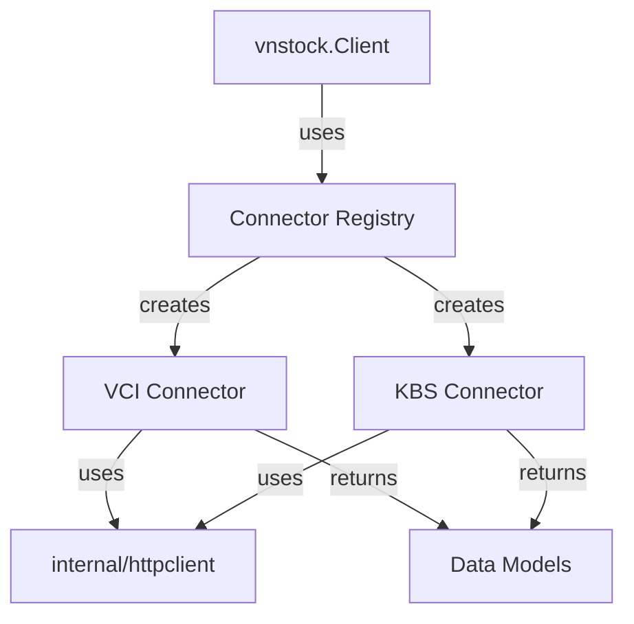
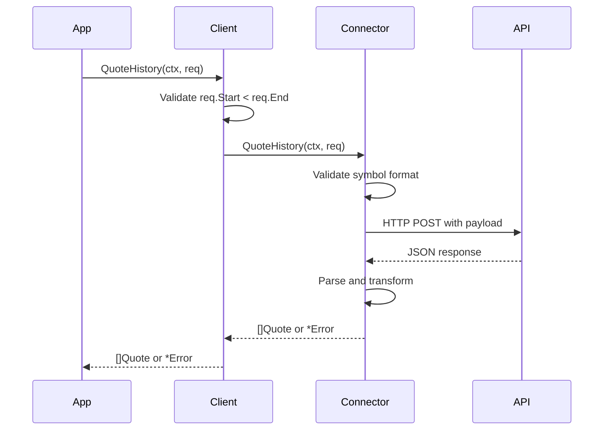

# Design Document: VCI-KBS Feature Parity

## Overview

This design implements missing VCI connector methods and adds a complete KBS (KB Securities) connector to achieve feature parity with the Python vnstock library. The implementation focuses on two main objectives:

1. **Complete VCI Connector**: Add Listing, IndexCurrent, IndexHistory, CompanyProfile, Officers, and FinancialStatement methods to the existing VCI connector
2. **New KBS Connector**: Implement a full-featured KBS connector with all Connector interface methods

The KBS connector is prioritized as the primary data source due to its stability and comprehensive data coverage (30+ columns for company data vs VCI's 10). Both connectors will follow the established patterns in the codebase: using the shared HTTP client, implementing proper error handling with typed error codes, and providing structured logging.

### Key Design Decisions

- **API Endpoint Discovery**: Since the Python vnstock source is not in this repository, API endpoints will be researched through documentation, network inspection, and iterative testing
- **GraphQL for VCI**: VCI's company and financial data uses a GraphQL endpoint at `https://trading.vietcap.com.vn/data-mt/graphql`
- **REST for KBS**: KBS uses traditional REST endpoints (to be discovered during implementation)
- **Shared HTTP Client**: Both connectors will use `internal/httpclient` for connection pooling and proxy support
- **Error Handling**: All errors will use the existing `vnstock.Error` type with appropriate error codes
- **Data Model Compatibility**: Both connectors return the same model types, enabling transparent connector switching

## Architecture

### Component Diagram



### Connector Architecture

Both connectors follow the same architectural pattern:

1. **Initialization**: Registered via `init()` function using `vnstock.RegisterConnector()`
2. **HTTP Client**: Receives shared `*http.Client` from `internal/httpclient`
3. **Logger**: Receives `*slog.Logger` for structured logging
4. **Request Flow**: 
   - Validate input parameters
   - Build API request (REST or GraphQL)
   - Execute HTTP request with logging
   - Parse response
   - Transform to vnstock models
   - Return data or typed error

### Data Flow



## Components and Interfaces

### KBS Connector Package

**Location**: `vnstock-go/connector/kbs/`

**Files**:
- `kbs.go`: Main connector implementation
- `kbs_test.go`: Unit tests with mocked HTTP responses
- `kbs_integration_test.go`: Integration tests with real API calls

**Public API**:
```go
package kbs

// Connector implements vnstock.Connector for KBS data source
type Connector struct {
    client *http.Client
    logger *slog.Logger
}

// New creates a new KBS connector
func New(client *http.Client, logger *slog.Logger) *Connector

// All vnstock.Connector interface methods
func (c *Connector) QuoteHistory(ctx context.Context, req vnstock.QuoteHistoryRequest) ([]vnstock.Quote, error)
func (c *Connector) RealTimeQuotes(ctx context.Context, symbols []string) ([]vnstock.Quote, error)
func (c *Connector) Listing(ctx context.Context, exchange string) ([]vnstock.ListingRecord, error)
func (c *Connector) IndexCurrent(ctx context.Context, name string) (vnstock.IndexRecord, error)
func (c *Connector) IndexHistory(ctx context.Context, req vnstock.IndexHistoryRequest) ([]vnstock.IndexRecord, error)
func (c *Connector) CompanyProfile(ctx context.Context, symbol string) (vnstock.CompanyProfile, error)
func (c *Connector) Officers(ctx context.Context, symbol string) ([]vnstock.Officer, error)
func (c *Connector) FinancialStatement(ctx context.Context, req vnstock.FinancialRequest) ([]vnstock.FinancialPeriod, error)
```

**Private helpers**:
```go
// doRequest performs HTTP request with logging
func (c *Connector) doRequest(ctx context.Context, method, url string, payload interface{}) (*http.Response, error)

// logRequest logs request details
func (c *Connector) logRequest(method, url string, statusCode int, elapsed time.Duration)

// validateSymbol checks symbol format
func validateSymbol(symbol string) error

// validateDateRange checks start < end
func validateDateRange(start, end time.Time) error
```

### VCI Connector Extensions

**Location**: `vnstock-go/connector/vci/vci.go`

**New Methods** (replacing TODO stubs):
```go
// Listing retrieves all symbols from VCI
func (c *Connector) Listing(ctx context.Context, exchange string) ([]vnstock.ListingRecord, error)

// IndexCurrent retrieves current index value
func (c *Connector) IndexCurrent(ctx context.Context, name string) (vnstock.IndexRecord, error)

// IndexHistory retrieves historical index data
func (c *Connector) IndexHistory(ctx context.Context, req vnstock.IndexHistoryRequest) ([]vnstock.IndexRecord, error)

// CompanyProfile retrieves company information via GraphQL
func (c *Connector) CompanyProfile(ctx context.Context, symbol string) (vnstock.CompanyProfile, error)

// Officers retrieves company officers via GraphQL
func (c *Connector) Officers(ctx context.Context, symbol string) ([]vnstock.Officer, error)

// FinancialStatement retrieves financial data via GraphQL
func (c *Connector) FinancialStatement(ctx context.Context, req vnstock.FinancialRequest) ([]vnstock.FinancialPeriod, error)
```

**New private helpers**:
```go
// doGraphQLRequest performs GraphQL query
func (c *Connector) doGraphQLRequest(ctx context.Context, query string, variables map[string]interface{}) (*http.Response, error)

// mapIndexName converts common index names to VCI format
func mapIndexName(name string) string
```

### Connector Registration

**Location**: `vnstock-go/vnstock.go`

**Update**: Add "KBS" to `validConnectors` map:
```go
var validConnectors = map[string]bool{
    "VCI":     true,
    "DNSE":    true,
    "FMP":     true,
    "Binance": true,
    "KBS":     true,  // NEW
}
```

The KBS connector will auto-register via its `init()` function:
```go
// In connector/kbs/kbs.go
func init() {
    vnstock.RegisterConnector("KBS", func(client *http.Client, logger *slog.Logger) vnstock.Connector {
        return New(client, logger)
    })
}
```

## Data Models

### Existing Models (No Changes Required)

All existing models in `vnstock-go/models.go` are sufficient for both connectors:

- `Quote`: OHLCV data with timestamp
- `ListingRecord`: Symbol, exchange, company name, sector
- `IndexRecord`: Index value with OHLCV and change metrics
- `CompanyProfile`: Company descriptive information
- `Officer`: Executive name, title, appointment date
- `FinancialPeriod`: Financial statement data with flexible `Fields` map

### Model Extension Considerations

If KBS provides additional fields not in current models, we have two options:

1. **Add optional fields**: Extend models with new fields (e.g., `CompanyProfile.Employees int`)
2. **Use flexible maps**: Leverage `FinancialPeriod.Fields` pattern for extensibility

For this implementation, we'll use existing models as-is and only extend if absolutely necessary to avoid breaking changes.

### Data Type Mapping

| Financial Data Type | Go Type | Rationale |
|---------------------|---------|-----------|
| Prices | `float64` | Standard for currency values |
| Volumes | `int64` | Whole numbers, can be large |
| Percentages | `float64` | Decimal precision needed |
| Dates | `time.Time` | Standard Go time handling |
| Periods | `string` | "annual", "quarterly" |
| Statement fields | `map[string]float64` | Flexible schema |

## API Endpoints Research

### VCI Endpoints

Based on existing implementation and requirements:

**Existing (Working)**:
- `POST /api/chart/OHLCChart/gap-chart`: Historical quotes
- `POST /api/market-watch/LEData/getAll`: Real-time quotes

**To Be Implemented**:
- GraphQL endpoint: `https://trading.vietcap.com.vn/data-mt/graphql`
  - Company profile query
  - Officers query
  - Financial statements query
  - Listing query
  - Index data query

**GraphQL Query Structure** (to be refined during implementation):
```graphql
query CompanyProfile($symbol: String!) {
  company(symbol: $symbol) {
    symbol
    name
    exchange
    sector
    industry
    founded
    website
    description
  }
}
```

### KBS Endpoints

To be discovered through:
1. Network inspection of KBS web platform
2. Analysis of Python vnstock KBS implementation (if accessible)
3. API documentation (if available)
4. Iterative testing and validation

**Expected endpoints** (placeholders):
- Quote history: `POST /api/quotes/history`
- Real-time quotes: `GET /api/quotes/realtime`
- Listing: `GET /api/listing`
- Index current: `GET /api/index/current`
- Index history: `POST /api/index/history`
- Company profile: `GET /api/company/{symbol}`
- Officers: `GET /api/company/{symbol}/officers`
- Financial statements: `GET /api/company/{symbol}/financials`

**Request/Response Format**: JSON (standard REST)

**Authentication**: To be determined (may require API key or session token)

### API Documentation

All discovered endpoints will be documented in `vnstock-go/API_ENDPOINTS.md` with:
- Full URL
- HTTP method
- Request payload format
- Response format
- Example requests/responses
- Error responses
- Rate limits (if any)

## Error Handling

### Error Code Usage

| Scenario | Error Code | Example |
|----------|------------|---------|
| Empty symbol parameter | `InvalidInput` | "symbol cannot be empty" |
| Start date after end date | `InvalidInput` | "start date must be before end date" |
| Invalid exchange name | `InvalidInput` | "exchange must be HOSE, HNX, or UPCOM" |
| Invalid statement type | `InvalidInput` | "type must be income, balance, or cashflow" |
| Network timeout | `NetworkError` | "request timeout after 30s" |
| DNS resolution failure | `NetworkError` | "failed to resolve host" |
| HTTP 400-499 | `HTTPError` | "HTTP 400: Bad Request" |
| HTTP 500-599 | `HTTPError` | "HTTP 500: Internal Server Error" |
| Symbol not found | `NotFound` | "symbol XYZ not found" |
| Empty API response | `NoData` | "no data available for date range" |
| JSON parse failure | `SerialiseError` | "failed to decode JSON response" |

### Error Construction Pattern

```go
// Input validation error
if symbol == "" {
    return nil, &vnstock.Error{
        Code:    vnstock.InvalidInput,
        Message: "symbol cannot be empty",
    }
}

// Network error with cause
if err != nil {
    return nil, &vnstock.Error{
        Code:    vnstock.NetworkError,
        Message: "request failed",
        Cause:   err,
    }
}

// HTTP error with status code
if resp.StatusCode >= 400 {
    return nil, &vnstock.Error{
        Code:       vnstock.HTTPError,
        Message:    fmt.Sprintf("HTTP error: %s", body),
        StatusCode: resp.StatusCode,
    }
}
```

### Input Validation

All connector methods will validate inputs before making API calls:

1. **Symbol validation**: Non-empty, alphanumeric, 3-10 characters
2. **Date validation**: Start before end, not in future
3. **Exchange validation**: Must be "HOSE", "HNX", "UPCOM", or empty
4. **Statement type validation**: Must be "income", "balance", or "cashflow"
5. **Period validation**: Must be "annual" or "quarterly"
6. **Index name validation**: Must be recognized index (VN-Index, HNX-Index, UPCOM-Index)

### Logging Strategy

All HTTP requests will be logged with:
- Log level: DEBUG
- Fields: method, url, status_code, elapsed_time
- Format: `c.logger.Debug("KBS request", slog.String("method", method), ...)`

Errors will be logged at WARN level before returning:
```go
c.logger.Warn("failed to fetch data", slog.String("symbol", symbol), slog.Any("error", err))
```


## Testing Strategy

### Dual Testing Approach

This feature will use both unit testing and property-based testing to ensure comprehensive coverage:

**Unit Tests**:
- Specific examples with known inputs and expected outputs
- Edge cases (empty strings, boundary dates, special characters)
- Error conditions (network failures, HTTP errors, invalid inputs)
- Integration points between components
- Mocked HTTP responses for fast, deterministic tests

**Property-Based Tests**:
- Universal properties that hold across all valid inputs
- Randomized input generation for comprehensive coverage
- Minimum 100 iterations per property test
- Each test tagged with reference to design property

Together, these approaches provide complementary coverage: unit tests catch concrete bugs and verify specific behaviors, while property tests verify general correctness across the input space.

### Property-Based Testing Configuration

**Library**: `pgregory.net/rapid` (already used in the project)

**Test Configuration**:
- Minimum 100 iterations per property test
- Each property test must reference its design document property
- Tag format: `// Feature: vci-kbs-feature-parity, Property {number}: {property_text}`

**Generator Strategy**:
- Symbol generator: 3-10 character alphanumeric strings
- Date range generator: Valid start/end pairs within last 5 years
- Exchange generator: "HOSE", "HNX", "UPCOM", ""
- Interval generator: "1D", "1H", "1m", "5m", "15m", "30m"
- Statement type generator: "income", "balance", "cashflow"
- Period generator: "annual", "quarterly"
- Index name generator: "VN-Index", "HNX-Index", "UPCOM-Index"

### Unit Test Organization

**Test Files**:
- `vnstock-go/connector/kbs/kbs_test.go`: Unit tests with mocked HTTP
- `vnstock-go/connector/kbs/kbs_integration_test.go`: Integration tests with real API
- `vnstock-go/connector/vci/vci_test.go`: Extended with new method tests
- `vnstock-go/connector/vci/vci_integration_test.go`: Extended with new method tests

**Mock Strategy**:
- Use `httptest.Server` for mocking HTTP responses
- Create reusable mock response fixtures
- Test both success and error paths
- Verify request payloads and headers

### Integration Test Strategy

Integration tests will:
- Call real KBS and VCI APIs
- Use real symbols from Vietnamese exchanges (VNM, VCB, HPG)
- Verify data structure and field population
- Run with `-integration` build tag to separate from unit tests
- Be excluded from CI/CD by default (require manual execution)

### Coverage Goals

- Unit test coverage: 80%+ for connector packages
- Property test coverage: All testable acceptance criteria
- Integration test coverage: All Connector interface methods


## Correctness Properties

A property is a characteristic or behavior that should hold true across all valid executions of a system—essentially, a formal statement about what the system should do. Properties serve as the bridge between human-readable specifications and machine-verifiable correctness guarantees.

### Property 1: Quote Interval Preservation

For any valid symbol, date range, and interval (daily, hourly, minute), when requesting historical quotes, all returned Quote records should have their Interval field set to the requested interval value.

**Validates: Requirements 1.3**

### Property 2: Real-Time Quote Symbol Matching

For any non-empty list of symbols, when requesting real-time quotes, all returned Quote records should have Symbol fields that match one of the requested symbols.

**Validates: Requirements 1.4**

### Property 3: Listing Exchange Filtering

For any non-empty exchange value (HOSE, HNX, UPCOM), when requesting listings filtered by that exchange, all returned ListingRecord entries should have their Exchange field equal to the requested exchange.

**Validates: Requirements 1.5, 2.3**

### Property 4: Index Data Retrieval

For any valid index name (VN-Index, HNX-Index, UPCOM-Index), when requesting current index data, the returned IndexRecord should have its Name field populated and Value field greater than zero.

**Validates: Requirements 1.6, 3.3**

### Property 5: Index History Date Range

For any valid index name and date range where start < end, when requesting historical index data, all returned IndexRecord entries should have Timestamp values within the requested date range (inclusive).

**Validates: Requirements 1.7, 3.4**

### Property 6: Company Profile Field Population

For any valid symbol, when requesting company profile data, the returned CompanyProfile should have at least the following fields populated: Symbol, Name, Exchange, and Sector (non-empty strings).

**Validates: Requirements 1.8, 4.3, 4.6**

### Property 7: Officers List Non-Empty

For any valid symbol, when requesting officers data, the returned list should contain at least one Officer with both Name and Title fields populated (non-empty strings).

**Validates: Requirements 1.9, 4.4**

### Property 8: Financial Statement Type Handling

For any valid symbol and statement type (income, balance, cashflow), when requesting financial statements, the returned FinancialPeriod list should be non-empty and each period should have a Fields map containing at least one entry.

**Validates: Requirements 1.10, 5.2, 5.3, 5.4**

### Property 9: Financial Period Support

For any valid symbol, statement type, and period type (annual, quarterly), when requesting financial statements, all returned FinancialPeriod entries should have their Period field equal to the requested period type.

**Validates: Requirements 5.5**

### Property 10: Financial Data Ordering

For any valid symbol and statement type, when requesting financial statements, the returned FinancialPeriod list should be sorted by (Year, Quarter) in descending order, such that for any two consecutive periods i and i+1, period i represents a more recent time than period i+1.

**Validates: Requirements 5.8**

### Property 11: Listing Required Fields

For any listing request (with or without exchange filter), all returned ListingRecord entries should have Symbol, CompanyName, and Exchange fields populated (non-empty strings).

**Validates: Requirements 2.4**

### Property 12: Invalid Date Range Rejection

For any date range where start >= end, when calling any method that accepts a date range (QuoteHistory, IndexHistory), the connector should return an error with Code equal to InvalidInput.

**Validates: Requirements 7.1**

### Property 13: Empty Parameter Rejection

For any connector method that requires a symbol parameter, when called with an empty string, the method should return an error with Code equal to InvalidInput.

**Validates: Requirements 7.2**

### Property 14: HTTP Error Code Mapping

For any HTTP response with status code >= 400, when the connector processes the response, it should return an error with Code equal to HTTPError and StatusCode field set to the actual HTTP status code.

**Validates: Requirements 7.4, 7.5, 2.5, 4.8**

### Property 15: Network Error Handling

For any network-level failure (timeout, DNS resolution failure, connection refused), when the connector attempts an HTTP request, it should return an error with Code equal to NetworkError.

**Validates: Requirements 7.3**

### Property 16: Error Message Preservation

For any error returned by a connector method, when the error wraps an underlying cause, calling Unwrap() on the error should return the original cause error.

**Validates: Requirements 7.6**

### Property 17: Symbol Format Validation

For any string that does not match the pattern of 3-10 alphanumeric characters, when used as a symbol parameter, the connector should return an error with Code equal to InvalidInput before making any HTTP request.

**Validates: Requirements 7.7**

### Property 18: Invalid Index Name Rejection

For any string that is not one of the recognized index names (VN-Index, HNX-Index, UPCOM-Index), when calling IndexCurrent or IndexHistory, the connector should return an error with Code equal to InvalidInput.

**Validates: Requirements 3.6**

### Property 19: Invalid Statement Type Rejection

For any string that is not one of the recognized statement types (income, balance, cashflow), when calling FinancialStatement, the connector should return an error with Code equal to InvalidInput.

**Validates: Requirements 5.7**

### Property 20: Connector Registration

For any connector name in the set {"VCI", "KBS", "DNSE", "FMP", "Binance"}, when creating a new Client with that connector name, the Client should be successfully created without error.

**Validates: Requirements 6.2, 6.3**

### Property 21: Invalid Connector Name Rejection

For any string that is not a recognized connector name, when creating a new Client with that connector name, the constructor should return an error with Code equal to ConfigError.

**Validates: Requirements 6.4**

### Property 22: Concurrent Request Safety

For any connector method and any set of concurrent goroutines calling that method with different parameters, when executed with the race detector enabled, no data races should be detected and all calls should complete without panics.

**Validates: Requirements 11.2**

