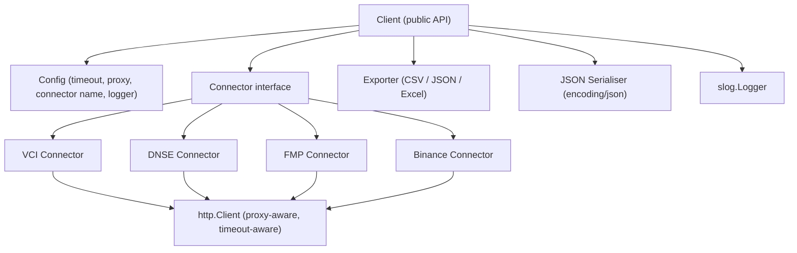

# Design Document: vnstock-go

## Overview

vnstock-go is an idiomatic Go module that provides programmatic access to Vietnamese stock market data. It is a feature-parity rewrite of the vnstock Python library, leveraging Go's static typing, native concurrency primitives, and high-performance HTTP stack.

The library is structured as a single Go module (`github.com/user/vnstock-go`) with a clean public API surface. Callers interact with a top-level `Client` struct that delegates all data fetching to a pluggable `Connector` interface. This design allows the library to support multiple upstream data providers (VCI, DNSE, FMP, Binance) without any changes to caller code.

Key design goals:
- Idiomatic Go: context propagation, error wrapping, `io.Writer`-based exporters
- Concurrency-safe by default: no shared mutable state between requests
- Pluggable data sources via the `Connector` interface
- Structured logging via `log/slog`
- Typed, inspectable errors

---

## Architecture



### Package Layout

```
vnstock-go/
├── vnstock.go          # Client, Config, New()
├── connector.go        # Connector interface definition
├── errors.go           # Error type, error codes
├── models.go           # Quote, Listing, IndexRecord, CompanyProfile, FinancialStatement
├── exporter/
│   ├── csv.go
│   ├── json.go
│   └── excel.go
├── connector/
│   ├── vci/
│   ├── dnse/
│   ├── fmp/
│   └── binance/
└── internal/
    └── httpclient/     # shared proxy-aware http.Client factory
```

### Request Lifecycle

1. Caller invokes a method on `Client` (e.g., `client.QuoteHistory(ctx, req)`)
2. `Client` validates the request parameters and returns an error immediately for invalid inputs
3. `Client` delegates to the active `Connector` implementation
4. The `Connector` builds an HTTP request, attaches the shared `http.Client`, and fires the request
5. The `Connector` parses the response into library model structs
6. `Client` returns the result or a wrapped `*Error` to the caller

---

## Components and Interfaces

### Client

```go
type Client struct {
    connector Connector
    logger    *slog.Logger
    config    Config
}

func New(cfg Config) (*Client, error)
```

`New` validates `cfg`, resolves environment variable defaults, constructs the named `Connector`, and returns a ready-to-use `Client`. It returns an error for any invalid config field before any network activity.

### Config

```go
type Config struct {
    Connector  string        // "VCI", "DNSE", "FMP", "Binance"
    ProxyURL   string        // optional, "http://host:port" or "https://host:port"
    Timeout    time.Duration // default: 30s
    MaxRetries int           // default: 3
    Logger     *slog.Logger  // optional, defaults to slog.Default()
}
```

Environment variable overrides (read when corresponding field is empty string / zero):
- `VNSTOCK_CONNECTOR` → `Config.Connector`
- `VNSTOCK_PROXY_URL` → `Config.ProxyURL`

### Connector Interface

```go
type Connector interface {
    QuoteHistory(ctx context.Context, req QuoteHistoryRequest) ([]Quote, error)
    RealTimeQuotes(ctx context.Context, symbols []string) ([]Quote, error)
    Listing(ctx context.Context, exchange string) ([]ListingRecord, error)
    IndexCurrent(ctx context.Context, name string) (IndexRecord, error)
    IndexHistory(ctx context.Context, req IndexHistoryRequest) ([]IndexRecord, error)
    CompanyProfile(ctx context.Context, symbol string) (CompanyProfile, error)
    Officers(ctx context.Context, symbol string) ([]Officer, error)
    FinancialStatement(ctx context.Context, req FinancialRequest) ([]FinancialPeriod, error)
}
```

Connectors that do not support a method return `ErrNotSupported` (an `*Error` with code `NotSupported`).

### HTTP Client Factory

```go
// internal/httpclient
func New(proxyURL string, timeout time.Duration) (*http.Client, error)
```

Builds an `*http.Client` with:
- `http.Transport` configured with the proxy URL (if provided)
- `Timeout` set on the client
- Connection pooling via `http.Transport` defaults

### Exporter

```go
type Exporter interface {
    ExportCSV(w io.Writer, records any) error
    ExportJSON(w io.Writer, records any) error
    ExportExcel(w io.Writer, records any) error
}
```

Concrete implementation uses `encoding/csv`, `encoding/json`, and `github.com/xuri/excelize/v2`.

### Error Type

```go
type ErrorCode string

const (
    NetworkError    ErrorCode = "NETWORK_ERROR"
    HTTPError       ErrorCode = "HTTP_ERROR"
    NotFound        ErrorCode = "NOT_FOUND"
    NotSupported    ErrorCode = "NOT_SUPPORTED"
    InvalidInput    ErrorCode = "INVALID_INPUT"
    NoData          ErrorCode = "NO_DATA"
    SerialiseError  ErrorCode = "SERIALISE_ERROR"
    ConfigError     ErrorCode = "CONFIG_ERROR"
)

type Error struct {
    Code    ErrorCode
    Message string
    Cause   error
    // HTTP-specific (zero value when not applicable)
    StatusCode int
}

func (e *Error) Error() string
func (e *Error) Unwrap() error
```

`*Error` implements `error` and is unwrappable via `errors.As` / `errors.Is`.

---

## Data Models

```go
type Quote struct {
    Symbol    string
    Timestamp time.Time
    Open      float64
    High      float64
    Low       float64
    Close     float64
    Volume    int64
    Interval  string
}

type ListingRecord struct {
    Symbol      string
    Exchange    string
    CompanyName string
    Sector      string
}

type IndexRecord struct {
    Name       string
    Timestamp  time.Time
    Value      float64
    Change     float64
    ChangePct  float64
    Open       float64
    High       float64
    Low        float64
    Close      float64
    Volume     int64
}

type CompanyProfile struct {
    Symbol       string
    Name         string
    Exchange     string
    Sector       string
    Industry     string
    Founded      string
    Website      string
    Description  string
}

type Officer struct {
    Name            string
    Title           string
    AppointmentDate string
}

type FinancialPeriod struct {
    Symbol  string
    Period  string // "annual" or "quarterly"
    Year    int
    Quarter int    // 0 for annual
    Fields  map[string]float64
}

// Request types
type QuoteHistoryRequest struct {
    Symbol    string
    Start     time.Time
    End       time.Time
    Interval  string
}

type IndexHistoryRequest struct {
    Name     string
    Start    time.Time
    End      time.Time
    Interval string
}

type FinancialRequest struct {
    Symbol    string
    Type      string // "income", "balance", "cashflow"
    Period    string // "annual", "quarterly"
}
```

All primary structs carry `json` struct tags for consistent serialisation. `time.Time` fields serialise as RFC 3339.

---

## Correctness Properties

*A property is a characteristic or behavior that should hold true across all valid executions of a system — essentially, a formal statement about what the system should do. Properties serve as the bridge between human-readable specifications and machine-verifiable correctness guarantees.*

### Property 1: Quote history is ordered ascending by timestamp

*For any* valid symbol, date range, and interval, the slice of Quote records returned by `QuoteHistory` shall be sorted in strictly ascending order by `Timestamp`.

**Validates: Requirements 1.1**

---

### Property 2: Invalid date range is rejected before network activity

*For any* `QuoteHistoryRequest` where `Start` is after `End`, `QuoteHistory` shall return an `*Error` with code `InvalidInput` and no outbound HTTP request shall be made.

**Validates: Requirements 1.3**

---

### Property 3: Real-time quotes cover all requested symbols

*For any* non-empty list of symbols supported by the connector, `RealTimeQuotes` shall return exactly one `Quote` per requested symbol, with each quote's `Symbol` field matching the corresponding request symbol.

**Validates: Requirements 2.1**

---

### Property 4: Concurrent requests are free of data races

*For any* set of goroutines calling any combination of `Client` methods simultaneously on the same `Client` instance, the program shall exhibit no data races as detected by the Go race detector (`-race`).

**Validates: Requirements 2.3, 11.1, 11.2**

---

### Property 5: Listing exchange filter returns only matching records

*For any* exchange name (HOSE, HNX, UPCOM) and any backing listing data, every `ListingRecord` returned by `Listing(ctx, exchange)` shall have its `Exchange` field equal to the requested exchange.

**Validates: Requirements 3.2**

---

### Property 6: Listing records contain all required fields

*For any* listing response, every `ListingRecord` shall have non-empty `Symbol`, `Exchange`, `CompanyName`, and `Sector` fields.

**Validates: Requirements 3.1**

---

### Property 7: Index history is ordered ascending by timestamp

*For any* valid index name, date range, and interval, the slice of `IndexRecord` values returned by `IndexHistory` shall be sorted in strictly ascending order by `Timestamp`.

**Validates: Requirements 4.2**

---

### Property 8: Company profile contains all required fields

*For any* valid symbol, the `CompanyProfile` returned shall have non-empty `Name`, `Exchange`, `Sector`, `Industry`, `Founded`, `Website`, and `Description` fields.

**Validates: Requirements 5.1**

---

### Property 9: Officer records contain all required fields

*For any* valid symbol, every `Officer` record returned by `Officers` shall have non-empty `Name`, `Title`, and `AppointmentDate` fields.

**Validates: Requirements 5.3**

---

### Property 10: Financial statements are ordered descending by period

*For any* valid financial statement request, the returned slice of `FinancialPeriod` records shall be sorted in strictly descending chronological order (by year, then quarter).

**Validates: Requirements 6.1**

---

### Property 11: Named connector routes all requests through that connector

*For any* valid connector name, every data method call on the resulting `Client` shall be dispatched to the connector identified by that name, and no other connector shall receive calls.

**Validates: Requirements 7.2**

---

### Property 12: Unrecognised connector name is rejected at construction

*For any* string that is not a recognised connector name, `New(cfg)` shall return a non-nil `*Error` with code `ConfigError` before any network activity occurs.

**Validates: Requirements 7.3**

---

### Property 13: Invalid Config fields are rejected at construction

*For any* `Config` with at least one invalid field value (e.g., negative timeout, malformed proxy URL), `New(cfg)` shall return a non-nil `*Error` with code `ConfigError`.

**Validates: Requirements 12.3**

---

### Property 14: CSV export produces valid structure for any data slice

*For any* non-empty slice of exportable records (Quote, ListingRecord, IndexRecord, CompanyProfile, FinancialPeriod), `ExportCSV` shall produce output that parses as valid CSV with exactly one header row and one data row per record.

**Validates: Requirements 9.1, 9.5**

---

### Property 15: JSON export produces valid array for any data slice

*For any* non-empty slice of exportable records, `ExportJSON` shall produce output that parses as a valid JSON array with exactly one element per record.

**Validates: Requirements 9.2, 9.5**

---

### Property 16: JSON serialisation round-trip

*For any* valid instance of a primary data struct (Quote, ListingRecord, IndexRecord, CompanyProfile, FinancialPeriod), marshalling to JSON and then unmarshalling shall produce a value equal to the original.

**Validates: Requirements 10.1, 10.3**

---

### Property 17: Unknown JSON fields are silently ignored

*For any* valid JSON payload for a primary struct that contains additional unrecognised fields, unmarshalling shall succeed and return the known fields without error.

**Validates: Requirements 10.4**

---

### Property 18: Network errors carry NetworkError code

*For any* connector method call that results in a network-level failure (connection refused, DNS failure, timeout), the returned error shall be an `*Error` with code `NetworkError` and the underlying cause shall be accessible via `errors.Unwrap`.

**Validates: Requirements 1.2, 13.2**

---

### Property 19: Non-2xx HTTP responses carry HTTP status code

*For any* connector method call where the upstream server returns an HTTP status code outside the 2xx range, the returned error shall be an `*Error` with code `HTTPError` and the `StatusCode` field set to the actual HTTP status code received.

**Validates: Requirements 13.3**

---

### Property 20: Error type is unwrappable via errors.As and errors.Is

*For any* `*Error` value returned by the library, `errors.As(err, &target)` shall succeed when `target` is of type `*Error`, and `errors.Is` shall correctly traverse the error chain via `Unwrap`.

**Validates: Requirements 13.4**

---

### Property 21: Debug log entries contain required fields for every request

*For any* connector request, the structured log entry emitted at DEBUG level shall contain the outbound request URL, HTTP method, response status code, and elapsed time as distinct log attributes.

**Validates: Requirements 14.4**

---

## Error Handling

### Error Type

All errors returned by the library are of type `*Error`. Callers can inspect the `Code` field to handle specific failure modes programmatically:

```go
var libErr *vnstock.Error
if errors.As(err, &libErr) {
    switch libErr.Code {
    case vnstock.NetworkError:
        // retry or check connectivity
    case vnstock.HTTPError:
        // inspect libErr.StatusCode
    case vnstock.NotFound:
        // symbol or index not found
    case vnstock.NotSupported:
        // connector doesn't support this method
    case vnstock.InvalidInput:
        // bad request parameters
    case vnstock.NoData:
        // empty listing or no financial data
    }
}
```

### Error Propagation Rules

| Scenario | Error Code | Notes |
|---|---|---|
| Network failure (DNS, TCP, TLS) | `NetworkError` | Wraps `net.Error` |
| HTTP status outside 2xx | `HTTPError` | `StatusCode` field set |
| Symbol not found by connector | `NotFound` | Message identifies symbol |
| Connector method not implemented | `NotSupported` | Message names the method |
| Invalid request parameters | `InvalidInput` | Returned before network call |
| Empty listing / no financial data | `NoData` | Distinguishes from NotFound |
| JSON deserialisation failure | `SerialiseError` | Identifies missing/bad field |
| Invalid Config at construction | `ConfigError` | Returned by `New()` |

### Partial Data

When a connector returns incomplete financial data (Requirement 6.2), the library returns the partial `[]FinancialPeriod` alongside a non-nil `*Error` with code `NoData` and a message listing the missing fields. Callers should check both the returned data and the error.

---

## Testing Strategy

### Dual Testing Approach

The test suite uses both unit tests and property-based tests. They are complementary:

- **Unit tests** cover specific examples, integration points, edge cases, and error conditions
- **Property-based tests** verify universal properties across randomly generated inputs

### Property-Based Testing

The library uses [`pgregory.net/rapid`](https://github.com/pgregory/rapid) as the property-based testing library for Go.

Each property-based test:
- Runs a minimum of **100 iterations** (rapid default; increase via `RAPID_CHECKS` env var)
- Is tagged with a comment referencing the design property it validates
- Tag format: `// Feature: vnstock-go-rewrite, Property N: <property_text>`

Example:

```go
// Feature: vnstock-go-rewrite, Property 16: JSON serialisation round-trip
func TestQuoteJSONRoundTrip(t *testing.T) {
    rapid.Check(t, func(t *rapid.T) {
        q := genQuote(t)
        b, err := json.Marshal(q)
        require.NoError(t, err)
        var got Quote
        require.NoError(t, json.Unmarshal(b, &got))
        require.Equal(t, q, got)
    })
}
```

### Property Test Coverage

| Property | Test Name | Pattern |
|---|---|---|
| 1: Quote history ordered ascending | `TestQuoteHistoryOrdering` | Invariant |
| 2: Invalid date range rejected | `TestQuoteHistoryInvalidDateRange` | Error condition |
| 3: Real-time quotes cover all symbols | `TestRealTimeQuotesCoverage` | Invariant |
| 4: Concurrent requests no data races | `TestConcurrentSafety` | Race detector |
| 5: Listing exchange filter | `TestListingExchangeFilter` | Metamorphic |
| 6: Listing record fields | `TestListingRecordFields` | Invariant |
| 7: Index history ordered ascending | `TestIndexHistoryOrdering` | Invariant |
| 8: Company profile fields | `TestCompanyProfileFields` | Invariant |
| 9: Officer record fields | `TestOfficerFields` | Invariant |
| 10: Financial statements ordered descending | `TestFinancialStatementOrdering` | Invariant |
| 11: Named connector routing | `TestConnectorRouting` | Model-based |
| 12: Unrecognised connector rejected | `TestUnrecognisedConnector` | Error condition |
| 13: Invalid Config rejected | `TestInvalidConfigRejected` | Error condition |
| 14: CSV export structure | `TestCSVExportStructure` | Invariant |
| 15: JSON export structure | `TestJSONExportStructure` | Invariant |
| 16: JSON round-trip | `TestJSONRoundTrip` | Round-trip |
| 17: Unknown JSON fields ignored | `TestUnknownJSONFieldsIgnored` | Error condition |
| 18: Network errors carry code | `TestNetworkErrorCode` | Invariant |
| 19: HTTP errors carry status code | `TestHTTPErrorStatusCode` | Invariant |
| 20: Error unwrappable | `TestErrorUnwrappable` | Invariant |
| 21: Debug log fields | `TestDebugLogFields` | Invariant |

### Unit Test Coverage

Unit tests focus on:
- **Specific examples**: known symbol lookups, known date ranges
- **Edge cases**: empty symbol list, zero-value Config, single-record responses
- **Error conditions**: 404 responses, proxy failures, missing JSON fields
- **Integration points**: `New()` constructor with env var overrides, exporter writing to `bytes.Buffer`

### Mock Strategy

- All connector tests use a `MockConnector` implementing the `Connector` interface
- HTTP-level tests use `httptest.NewServer` to simulate upstream responses
- Proxy tests use a local `httptest.NewServer` acting as a forwarding proxy
- Logger tests use a `slog.Handler` backed by a `bytes.Buffer` to capture output

### Test Organisation

```
vnstock-go/
├── vnstock_test.go          # Client, Config, New() unit tests
├── errors_test.go           # Error type, unwrapping
├── exporter/
│   ├── csv_test.go
│   ├── json_test.go
│   └── excel_test.go
├── connector/
│   ├── vci/vci_test.go
│   ├── dnse/dnse_test.go
│   └── ...
└── internal/
    └── httpclient/httpclient_test.go
```
